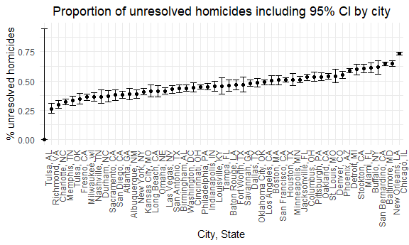

Homework 5
================
Tim Hauser

## Initial setup

``` r
library(tidyverse)
```

    ## ── Attaching packages ─────────────────────────────────────── tidyverse 1.3.2 ──
    ## ✔ ggplot2 3.3.6      ✔ purrr   0.3.4 
    ## ✔ tibble  3.1.8      ✔ dplyr   1.0.10
    ## ✔ tidyr   1.2.0      ✔ stringr 1.4.1 
    ## ✔ readr   2.1.2      ✔ forcats 0.5.2 
    ## ── Conflicts ────────────────────────────────────────── tidyverse_conflicts() ──
    ## ✖ dplyr::filter() masks stats::filter()
    ## ✖ dplyr::lag()    masks stats::lag()

``` r
library(rvest)
```

    ## 
    ## Attaching package: 'rvest'
    ## 
    ## The following object is masked from 'package:readr':
    ## 
    ##     guess_encoding

``` r
library(p8105.datasets)

knitr::opts_chunk$set(
  fig.width = 6,
  fig.asp = .6,
  out.width = "90%"
)

theme_set(theme_minimal() + theme(legend.position = "bottom"))

options(
  ggplot2.continuous.colour = "viridis",
  ggplot2.continuous.fill = "viridis"
)

scale_colour_discrete = scale_colour_viridis_d
scale_fill_discrete = scale_fill_viridis_d
```

## Problem 1

The code chunk below imports the data in individual spreadsheets
contained in `./data/zip_data/`. To do this, I create a dataframe that
includes the list of all files in that directory and the complete path
to each file. As a next step, I `map` over paths and import data using
the `read_csv` function. Finally, I `unnest` the result of `map`.

``` r
full_df = 
  tibble(
    files = list.files("data/zip_data/"),
    path = str_c("data/zip_data/", files)
  ) %>% 
  mutate(data = map(path, read_csv)) %>% 
  unnest()
```

    ## Rows: 1 Columns: 8
    ## ── Column specification ────────────────────────────────────────────────────────
    ## Delimiter: ","
    ## dbl (8): week_1, week_2, week_3, week_4, week_5, week_6, week_7, week_8
    ## 
    ## ℹ Use `spec()` to retrieve the full column specification for this data.
    ## ℹ Specify the column types or set `show_col_types = FALSE` to quiet this message.
    ## Rows: 1 Columns: 8
    ## ── Column specification ────────────────────────────────────────────────────────
    ## Delimiter: ","
    ## dbl (8): week_1, week_2, week_3, week_4, week_5, week_6, week_7, week_8
    ## 
    ## ℹ Use `spec()` to retrieve the full column specification for this data.
    ## ℹ Specify the column types or set `show_col_types = FALSE` to quiet this message.
    ## Rows: 1 Columns: 8
    ## ── Column specification ────────────────────────────────────────────────────────
    ## Delimiter: ","
    ## dbl (8): week_1, week_2, week_3, week_4, week_5, week_6, week_7, week_8
    ## 
    ## ℹ Use `spec()` to retrieve the full column specification for this data.
    ## ℹ Specify the column types or set `show_col_types = FALSE` to quiet this message.
    ## Rows: 1 Columns: 8
    ## ── Column specification ────────────────────────────────────────────────────────
    ## Delimiter: ","
    ## dbl (8): week_1, week_2, week_3, week_4, week_5, week_6, week_7, week_8
    ## 
    ## ℹ Use `spec()` to retrieve the full column specification for this data.
    ## ℹ Specify the column types or set `show_col_types = FALSE` to quiet this message.
    ## Rows: 1 Columns: 8
    ## ── Column specification ────────────────────────────────────────────────────────
    ## Delimiter: ","
    ## dbl (8): week_1, week_2, week_3, week_4, week_5, week_6, week_7, week_8
    ## 
    ## ℹ Use `spec()` to retrieve the full column specification for this data.
    ## ℹ Specify the column types or set `show_col_types = FALSE` to quiet this message.
    ## Rows: 1 Columns: 8
    ## ── Column specification ────────────────────────────────────────────────────────
    ## Delimiter: ","
    ## dbl (8): week_1, week_2, week_3, week_4, week_5, week_6, week_7, week_8
    ## 
    ## ℹ Use `spec()` to retrieve the full column specification for this data.
    ## ℹ Specify the column types or set `show_col_types = FALSE` to quiet this message.
    ## Rows: 1 Columns: 8
    ## ── Column specification ────────────────────────────────────────────────────────
    ## Delimiter: ","
    ## dbl (8): week_1, week_2, week_3, week_4, week_5, week_6, week_7, week_8
    ## 
    ## ℹ Use `spec()` to retrieve the full column specification for this data.
    ## ℹ Specify the column types or set `show_col_types = FALSE` to quiet this message.
    ## Rows: 1 Columns: 8
    ## ── Column specification ────────────────────────────────────────────────────────
    ## Delimiter: ","
    ## dbl (8): week_1, week_2, week_3, week_4, week_5, week_6, week_7, week_8
    ## 
    ## ℹ Use `spec()` to retrieve the full column specification for this data.
    ## ℹ Specify the column types or set `show_col_types = FALSE` to quiet this message.
    ## Rows: 1 Columns: 8
    ## ── Column specification ────────────────────────────────────────────────────────
    ## Delimiter: ","
    ## dbl (8): week_1, week_2, week_3, week_4, week_5, week_6, week_7, week_8
    ## 
    ## ℹ Use `spec()` to retrieve the full column specification for this data.
    ## ℹ Specify the column types or set `show_col_types = FALSE` to quiet this message.
    ## Rows: 1 Columns: 8
    ## ── Column specification ────────────────────────────────────────────────────────
    ## Delimiter: ","
    ## dbl (8): week_1, week_2, week_3, week_4, week_5, week_6, week_7, week_8
    ## 
    ## ℹ Use `spec()` to retrieve the full column specification for this data.
    ## ℹ Specify the column types or set `show_col_types = FALSE` to quiet this message.
    ## Rows: 1 Columns: 8
    ## ── Column specification ────────────────────────────────────────────────────────
    ## Delimiter: ","
    ## dbl (8): week_1, week_2, week_3, week_4, week_5, week_6, week_7, week_8
    ## 
    ## ℹ Use `spec()` to retrieve the full column specification for this data.
    ## ℹ Specify the column types or set `show_col_types = FALSE` to quiet this message.
    ## Rows: 1 Columns: 8
    ## ── Column specification ────────────────────────────────────────────────────────
    ## Delimiter: ","
    ## dbl (8): week_1, week_2, week_3, week_4, week_5, week_6, week_7, week_8
    ## 
    ## ℹ Use `spec()` to retrieve the full column specification for this data.
    ## ℹ Specify the column types or set `show_col_types = FALSE` to quiet this message.
    ## Rows: 1 Columns: 8
    ## ── Column specification ────────────────────────────────────────────────────────
    ## Delimiter: ","
    ## dbl (8): week_1, week_2, week_3, week_4, week_5, week_6, week_7, week_8
    ## 
    ## ℹ Use `spec()` to retrieve the full column specification for this data.
    ## ℹ Specify the column types or set `show_col_types = FALSE` to quiet this message.
    ## Rows: 1 Columns: 8
    ## ── Column specification ────────────────────────────────────────────────────────
    ## Delimiter: ","
    ## dbl (8): week_1, week_2, week_3, week_4, week_5, week_6, week_7, week_8
    ## 
    ## ℹ Use `spec()` to retrieve the full column specification for this data.
    ## ℹ Specify the column types or set `show_col_types = FALSE` to quiet this message.
    ## Rows: 1 Columns: 8
    ## ── Column specification ────────────────────────────────────────────────────────
    ## Delimiter: ","
    ## dbl (8): week_1, week_2, week_3, week_4, week_5, week_6, week_7, week_8
    ## 
    ## ℹ Use `spec()` to retrieve the full column specification for this data.
    ## ℹ Specify the column types or set `show_col_types = FALSE` to quiet this message.
    ## Rows: 1 Columns: 8
    ## ── Column specification ────────────────────────────────────────────────────────
    ## Delimiter: ","
    ## dbl (8): week_1, week_2, week_3, week_4, week_5, week_6, week_7, week_8
    ## 
    ## ℹ Use `spec()` to retrieve the full column specification for this data.
    ## ℹ Specify the column types or set `show_col_types = FALSE` to quiet this message.
    ## Rows: 1 Columns: 8
    ## ── Column specification ────────────────────────────────────────────────────────
    ## Delimiter: ","
    ## dbl (8): week_1, week_2, week_3, week_4, week_5, week_6, week_7, week_8
    ## 
    ## ℹ Use `spec()` to retrieve the full column specification for this data.
    ## ℹ Specify the column types or set `show_col_types = FALSE` to quiet this message.
    ## Rows: 1 Columns: 8
    ## ── Column specification ────────────────────────────────────────────────────────
    ## Delimiter: ","
    ## dbl (8): week_1, week_2, week_3, week_4, week_5, week_6, week_7, week_8
    ## 
    ## ℹ Use `spec()` to retrieve the full column specification for this data.
    ## ℹ Specify the column types or set `show_col_types = FALSE` to quiet this message.
    ## Rows: 1 Columns: 8
    ## ── Column specification ────────────────────────────────────────────────────────
    ## Delimiter: ","
    ## dbl (8): week_1, week_2, week_3, week_4, week_5, week_6, week_7, week_8
    ## 
    ## ℹ Use `spec()` to retrieve the full column specification for this data.
    ## ℹ Specify the column types or set `show_col_types = FALSE` to quiet this message.
    ## Rows: 1 Columns: 8
    ## ── Column specification ────────────────────────────────────────────────────────
    ## Delimiter: ","
    ## dbl (8): week_1, week_2, week_3, week_4, week_5, week_6, week_7, week_8
    ## 
    ## ℹ Use `spec()` to retrieve the full column specification for this data.
    ## ℹ Specify the column types or set `show_col_types = FALSE` to quiet this message.

    ## Warning: `cols` is now required when using unnest().
    ## Please use `cols = c(data)`

The result of the previous code chunk isn’t tidy – data are wide rather
than long, and some important variables are included as parts of others.
The code chunk below tides the data using string manipulations on the
file, converting from wide to long, and selecting relevant variables.

``` r
tidy_df = 
  full_df %>% 
  mutate(
    files = str_replace(files, ".csv", ""),
    group = str_sub(files, 1, 3)) %>% 
  pivot_longer(
    week_1:week_8,
    names_to = "week",
    values_to = "outcome",
    names_prefix = "week_") %>% 
  mutate(week = as.numeric(week)) %>% 
  select(group, subj = files, week, outcome)
```

Finally, the code chunk below creates a plot showing individual data,
faceted by group.

``` r
tidy_df %>% 
  ggplot(aes(x = week, y = outcome, group = subj, color = group)) + 
  geom_point() + 
  geom_path() + 
  facet_grid(~group)
```


This plot suggests high within-subject correlation – subjects who start
above average end up above average, and those that start below average
end up below average. Subjects in the control group generally don’t
change over time, but those in the experiment group increase their
outcome in a roughly linear way.

## Problem 2

I downloaded the .csv file from github and added it to the data folder.
The following code chunk imports the data into R as a dataframe:

``` r
homicide_raw = read.csv("./data/homicide-data.csv") %>% 
  janitor::clean_names()
```

The homicides dataset was gathered and made public by The Washington
Post on more than 52,000 criminal homicides over the past decade in 50
large U.S. cities. It contains `52179` observations of homicides and
`12` variables, namely
`uid, reported_date, victim_last, victim_first, victim_race, victim_age, victim_sex, city, state, lat, lon, disposition`.
The variables contain information about the date of the homicide, the
victim (name, age, race, sex), the location of the homicide (city,
state, lon, lat) and whether an arrest was made or not.

Next, I created a city_state variable (e.g. “Baltimore, MD”) and status
variable indicating whether a homicide was solved (those for which the
disposition is “Closed by arrest”) or unsolved (those for which the
disposition is “Closed without arrest” or “Open/No arrest”):

``` r
homicide_df = homicide_raw %>% 
  mutate(city_state = str_c(city, ", ", state),
         status = case_when(
           disposition == "Closed without arrest" ~ "unsolved",
           disposition == "Open/No arrest" ~ "unsolved",
           disposition == "Closed by arrest" ~ "solved"
         )) %>% 
  relocate(city_state)
```

Next, I summarize within cities to obtain the total number of homicides
and the number of unsolved homicides:

``` r
homicide_df %>%
  group_by(city_state, status) %>%
  count(status) %>%
  spread(key = status, value = n) %>% 
  arrange(desc(unsolved)) %>% 
  knitr::kable()
```

| city_state         | solved | unsolved |
|:-------------------|-------:|---------:|
| Chicago, IL        |   1462 |     4073 |
| Baltimore, MD      |   1002 |     1825 |
| Houston, TX        |   1449 |     1493 |
| Detroit, MI        |   1037 |     1482 |
| Philadelphia, PA   |   1677 |     1360 |
| Los Angeles, CA    |   1151 |     1106 |
| New Orleans, LA    |    504 |      930 |
| St. Louis, MO      |    772 |      905 |
| Dallas, TX         |    813 |      754 |
| Jacksonville, FL   |    571 |      597 |
| Indianapolis, IN   |    728 |      594 |
| Washington, DC     |    756 |      589 |
| Columbus, OH       |    509 |      575 |
| Las Vegas, NV      |    809 |      572 |
| Oakland, CA        |    439 |      508 |
| Phoenix, AZ        |    410 |      504 |
| Kansas City, MO    |    704 |      486 |
| Memphis, TN        |   1031 |      483 |
| Miami, FL          |    294 |      450 |
| Milwaukee, wI      |    712 |      403 |
| Atlanta, GA        |    600 |      373 |
| San Antonio, TX    |    476 |      357 |
| Birmingham, AL     |    453 |      347 |
| Pittsburgh, PA     |    294 |      337 |
| San Francisco, CA  |    327 |      336 |
| Oklahoma City, OK  |    346 |      326 |
| Buffalo, NY        |    202 |      319 |
| Boston, MA         |    304 |      310 |
| Cincinnati, OH     |    385 |      309 |
| Nashville, TN      |    489 |      278 |
| Stockton, CA       |    178 |      266 |
| Louisville, KY     |    315 |      261 |
| Fort Worth, TX     |    294 |      255 |
| New York, NY       |    384 |      243 |
| Charlotte, NC      |    481 |      206 |
| Baton Rouge, LA    |    228 |      196 |
| Tulsa, OK          |    390 |      193 |
| Minneapolis, MN    |    179 |      187 |
| San Diego, CA      |    286 |      175 |
| San Bernardino, CA |    105 |      170 |
| Denver, CO         |    143 |      169 |
| Fresno, CA         |    318 |      169 |
| Omaha, NE          |    240 |      169 |
| Long Beach, CA     |    222 |      156 |
| Albuquerque, NM    |    232 |      146 |
| Sacramento, CA     |    237 |      139 |
| Savannah, GA       |    131 |      115 |
| Richmond, VA       |    316 |      113 |
| Durham, NC         |    175 |      101 |
| Tampa, FL          |    113 |       95 |
| Tulsa, AL          |      1 |       NA |

The city with the most unsolved crimes (absolute, not as a %) is
Chicago, IL.

Next, for the city of Baltimore, MD, I used the prop.test function to
estimate the proportion of homicides that are unsolved; saved the output
of prop.test as an R object, applied the broom::tidy to this object and
pulled the estimated proportion and confidence intervals from the
resulting tidy dataframe:

``` r
baltimore_df = homicide_df %>%
  filter(city_state == "Baltimore, MD")

baltimore_unsolved = baltimore_df %>%   
  summarize(
    unsolved = sum(status == "unsolved"),
    n = n()
  )
  
baltimore_prop = 
  prop.test(
    x = baltimore_unsolved$unsolved,
    n = baltimore_unsolved$n) %>% 
  broom::tidy()
```

Baltimore has 64.5% unresolved homicides with a 95% CI of 62.8%-66.3%.

Next, I ran prop.test for each of the cities in the homicide dataset and
extracted both the proportion of unsolved homicides and the confidence
interval for each.

First, I created a function that calculates the proportion of unresolved
crimes and a corresponding CI:

``` r
prop_function = function(city_df) {
  
  city_unsolved =
    city_df %>%
    summarize(
      unsolved = sum(status == "unsolved"),
      n = n()
      )
  
  city_prop =
    prop.test(
      x = city_unsolved$unsolved,
      n = city_unsolved$n)
  
  return(city_prop)
}
```

Second, I created a nested dataframe

``` r
nested_df = homicide_df %>%
  nest(data = uid:status) %>% 
  mutate(
    test_results = map(data, prop_function),
    tidy_results = map(test_results, broom::tidy)
  ) %>% 
  select(city_state, tidy_results) %>% 
  unnest(tidy_results) %>% 
  select(city_state, estimate, starts_with("conf"))
```

    ## Warning in prop.test(x = city_unsolved$unsolved, n = city_unsolved$n): Chi-
    ## squared approximation may be incorrect

Lastly, I created a plot that shows the estimates and CIs for each city
using geom_errorbar to add error bars based on the upper and lower
limits. I organized cities according to the proportion of unsolved
homicides:

``` r
nested_df %>%
  mutate(city_state = fct_reorder(city_state, estimate)) %>%
  ggplot(aes(x = city_state, y = estimate)) +
  geom_point() +
  geom_errorbar(aes(ymin = conf.low, ymax = conf.high)) +
  theme(axis.text.x = element_text(angle = 90, hjust = 1), 
        plot.title = element_text(hjust = 0.5)) +
  labs(title = "Proportion of unresolved homicides including 95% CI by city",
       x = "City, State",
       y = "% unresolved homicides") 
```



## Problem 3
